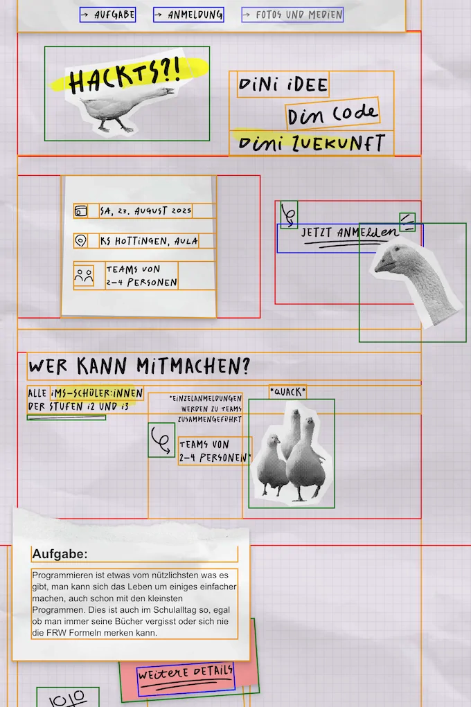

# Challenges in Implementing the [hackts.ch](https://hackts.ch) Design

While building the hackts.ch site, I encountered layout issues that I did not anticipate. The design came from a highly customised Figma file with precise alignments, irregular shapes and spacing patterns.

I chose Rails with custom Sass stylesheets because of the abundance of unique styling across the page. [Bootstrap](https://getbootstrap.com/) felt difficult to adapt to the design, and [Tailwind’s utility classes](https://tailwindcss.com/docs/utility-first) were not flexible enough for the level of customisation required.

## The Design Gap

As you can see in the box model view, the layout contains many irregular spacings, varying element sizes, and non-uniform alignments. These characteristics made it difficult to implement using flexbox or grid with simple gaps, margins, and paddings, and required precise, element by element positioning.

  
*A draft of the hackts.ch page with box model inspection, showing the irregular spacing and alignment requirements.*

I also experimented with Figma to code tools such as [Builder.io’s Figma plugin](https://www.builder.io/c/docs/figma-to-builder) but the results were disappointing. The generated markup was verbose and composed of inline styles, with font styling defined multiple times instead of integrating with the existing font definitions. There was no clear component structure or hierarchy, which made the output unpleasant to read.

## Retrospective Approaches

Looking back, several methods might have eased the process:

- Rendering sections as images with defined clickable areas using [`<area>`](https://developer.mozilla.org/en-US/docs/Web/HTML/Reference/Elements/area) elements  
- Using background images with text overlays  
- Exporting directly from Figma as SVGs to keep both vector shapes and text, applying CSS classes to [SVG elements](https://developer.mozilla.org/en-US/docs/Web/SVG/Reference/Element/style) for consistent styling ([MDN: Styling SVG with CSS](https://developer.mozilla.org/en-US/docs/Web/SVG/Tutorial/SVG_and_CSS))  
- Adding overlays for pixel accurate alignment adjustments  

While each could have been useful, all still required manual editing of pixel values.

## A Possible Solution

A more efficient solution could be to build a GUI editor in Rails for placing visual components.  
Such an editor could work similarly to [JavaFX Scene Builder](https://openjfx.io/scenebuilder/) or other drag and drop UI layout tools. Developers could place images, text, and overlays directly in the browser, adjusting positions interactively instead of editing CSS values and refreshing the page.

The implementation could store element coordinates and properties in the database, with `position: relative` containers handling placement in the final rendering. This would allow pixel accurate adjustments without touching the stylesheets for every change.

An approach could borrow concepts from [Herb LSP](https://marcoroth.dev/posts/introducing-herb), which proposes a language server for HTML and embedded Ruby, but adapt them to support live visual positioning of components.  
As [David Heinemeier Hansson](https://world.hey.com/dhh/finding-the-last-editor-dae701cc) has noted, there is value in keeping the development process grounded in simple, direct editing environments. A GUI editor should complement text based workflows, not replace them, allowing developers to maintain clean and maintainable code while benefiting from faster layout adjustments.

## Conclusion

Highly customised designs often make standard frameworks and layout approaches less effective. Even with Sass for flexibility, aligning to the Figma design became a slow and manual process. A GUI editor for Rails, inspired by tools like Scene Builder, could provide an efficient and interactive way to place and adjust components, reducing the need for repetitive code edits while keeping the underlying code approachable.
